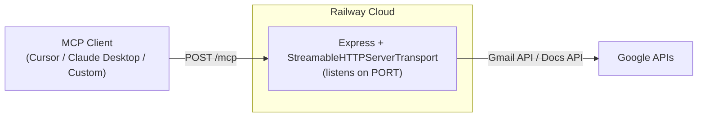
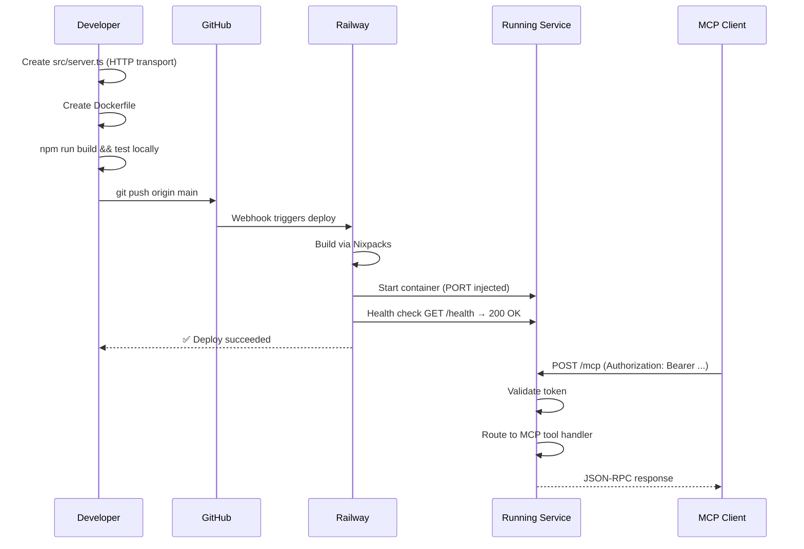

# Railway Deployment Plan — MCP Gmail & Google Docs Server

A step-by-step guide to deploying this MCP server to [Railway](https://railway.app) as a publicly reachable HTTP service that any remote MCP client can connect to.

---

## 0. Architecture Overview



> [!IMPORTANT]
> **Transport Migration Required** — The server currently uses `StdioServerTransport`, which only works for local processes. Railway expects an HTTP-listening service. We must add a thin Express wrapper using the `StreamableHTTPServerTransport` from the MCP SDK.

---

## 1. Pre-Deployment Checklist

| # | Item | Status | Action Required |
|---|------|--------|-----------------|
| 1 | `.gitignore` covers secrets (`.env`, `credentials.json`, `tokens.json`) | ✅ | Already configured |
| 2 | `.env.example` exists with placeholder values | ✅ | Already present |
| 3 | Project builds cleanly (`npm run build`) | ✅ | Verify before deploy |
| 4 | No hardcoded secrets in `src/` | ✅ | Audit all `.ts` files |
| 5 | Transport migration to Streamable HTTP | ✅ | See [Section 2](#2-transport-migration-stdio--streamable-http) |
| 6 | GitHub repo created and pushed | ⬜ | See [Section 3](#3-github-repository-setup) |

> [!CAUTION]
> **Never commit `.env`, `credentials.json`, or `tokens.json`** to the repository. These contain OAuth secrets and refresh tokens that grant full access to your Google account. If accidentally committed, rotate credentials immediately in the [Google Cloud Console](https://console.cloud.google.com/).

---

## 2. Transport Migration (Stdio → Streamable HTTP)

Railway requires your service to listen on an HTTP port. The current `src/index.ts` uses `StdioServerTransport` which communicates over process stdin/stdout — this doesn't work in the cloud.

### 2.1 Install Additional Dependencies

```bash
npm install express
npm install -D @types/express
```

### 2.2 Create `src/server.ts` (HTTP Entry Point)

Create a new file `src/server.ts` that wraps your existing MCP server logic with an Express HTTP layer:

```typescript
import express from 'express';
import { Server } from '@modelcontextprotocol/sdk/server/index.js';
import { StreamableHTTPServerTransport } from '@modelcontextprotocol/sdk/server/streamableHttp.js';
import { CallToolRequestSchema, ListToolsRequestSchema } from '@modelcontextprotocol/sdk/types.js';

import { handleGmailSendEmail } from './tools/gmailSendEmail.js';
import { handleGmailCreateDraft } from './tools/gmailCreateDraft.js';
import { handleGdocsAppendContent } from './tools/gdocsAppendContent.js';

const app = express();
app.use(express.json());

// --- Health check endpoint (Railway uses this to confirm the service is alive) ---
app.get('/health', (_req, res) => {
  res.json({ status: 'ok', server: 'mcp-gmail-docs', version: '1.0.0' });
});

// --- MCP endpoint ---
app.all('/mcp', async (req, res) => {
  // Optional: Bearer token authentication (see Section 6)
  const authHeader = req.headers.authorization;
  const expectedToken = process.env.MCP_AUTH_TOKEN;
  if (expectedToken && authHeader !== `Bearer ${expectedToken}`) {
    res.status(401).json({ error: 'Unauthorized' });
    return;
  }

  // Create a fresh MCP server instance per request (stateless)
  const server = new Server(
    { name: 'mcp-gmail-docs', version: '1.0.0' },
    { capabilities: { tools: {} } }
  );

  // Register tool list handler
  server.setRequestHandler(ListToolsRequestSchema, async () => ({
    tools: [
      {
        name: 'gmail_send_email',
        description: 'Send an email immediately via Gmail on behalf of the authenticated user.',
        inputSchema: {
          type: 'object',
          properties: {
            to: { type: 'array', items: { type: 'string' }, description: 'Recipient email addresses' },
            cc: { type: 'array', items: { type: 'string' } },
            bcc: { type: 'array', items: { type: 'string' } },
            subject: { type: 'string' },
            body: { type: 'string', description: 'Email body content' },
            bodyType: { type: 'string', enum: ['text', 'html'], default: 'text' },
            threadId: { type: 'string', description: 'Optional: reply within an existing thread' }
          },
          required: ['to', 'subject', 'body']
        }
      },
      {
        name: 'gmail_create_draft',
        description: 'Create a Gmail draft without sending it.',
        inputSchema: {
          type: 'object',
          properties: {
            to: { type: 'array', items: { type: 'string' } },
            cc: { type: 'array', items: { type: 'string' } },
            bcc: { type: 'array', items: { type: 'string' } },
            subject: { type: 'string' },
            body: { type: 'string' },
            bodyType: { type: 'string', enum: ['text', 'html'], default: 'text' }
          },
          required: ['to', 'subject', 'body']
        }
      },
      {
        name: 'gdocs_append_content',
        description: 'Append text content to the end of an existing Google Doc.',
        inputSchema: {
          type: 'object',
          properties: {
            documentId: { type: 'string', description: 'Google Doc ID (or full URL, to be parsed)' },
            content: { type: 'string', description: 'Text content to append' },
            addSeparator: { type: 'boolean', default: false, description: 'Insert a newline/divider before the appended content' }
          },
          required: ['documentId', 'content']
        }
      }
    ]
  }));

  // Register tool call handler
  server.setRequestHandler(CallToolRequestSchema, async (request) => {
    const { name, arguments: args } = request.params;
    let result;
    switch (name) {
      case 'gmail_send_email':
        result = await handleGmailSendEmail(args || {});
        break;
      case 'gmail_create_draft':
        result = await handleGmailCreateDraft(args || {});
        break;
      case 'gdocs_append_content':
        result = await handleGdocsAppendContent(args || {});
        break;
      default:
        throw new Error(`Unknown tool: ${name}`);
    }
    return {
      content: [{ type: 'text', text: JSON.stringify(result, null, 2) }]
    };
  });

  // Create transport and handle the request
  const transport = new StreamableHTTPServerTransport({ sessionIdGenerator: undefined });
  await server.connect(transport);
  await transport.handleRequest(req, res);
});

// --- Start the server ---
const PORT = parseInt(process.env.PORT || '3000', 10);
app.listen(PORT, '0.0.0.0', () => {
  console.log(`MCP Gmail & Google Docs Server listening on http://0.0.0.0:${PORT}`);
  console.log(`  → MCP endpoint: POST /mcp`);
  console.log(`  → Health check: GET  /health`);
});
```

### 2.3 Update `package.json` Scripts

```diff
  "scripts": {
-   "start": "node build/index.js",
+   "start": "node build/server.js",
+   "start:stdio": "node build/index.js",
    "build": "tsc",
    "test": "echo \"Error: no test specified\" && exit 1"
  }
```

> [!NOTE]
> The original `src/index.ts` (stdio mode) is preserved as `npm run start:stdio` for local MCP client usage (e.g., Claude Desktop, Cursor). The new `npm start` launches the HTTP server for Railway.

### 2.4 Verify Locally

```bash
npm run build
npm start

# In another terminal, test the health endpoint:
curl http://localhost:3000/health

# Test the MCP endpoint with a tool list request:
curl -X POST http://localhost:3000/mcp \
  -H "Content-Type: application/json" \
  -d '{"jsonrpc":"2.0","id":1,"method":"tools/list","params":{}}'
```

---

## 3. GitHub Repository Setup

### 4.1 Create and Push

```bash
cd "d:\NEXTLEAP GEN AI\MCP SERVER"

git init
git remote add origin https://github.com/<your-username>/mcp-gmail-docs-server.git

# Verify nothing sensitive is staged
git status
git add .
git commit -m "feat: initial release with Railway HTTP transport"
git branch -M main
git push -u origin main
```

### 4.2 Recommended Repository Settings

| Setting | Value |
|---------|-------|
| Visibility | **Private** (contains Google API integration) |
| Default Branch | `main` |
| Topics | `mcp`, `gmail`, `google-docs`, `railway` |

---

## 5. Railway Deployment

### 5.1 Create a Railway Project

1. Go to [railway.app](https://railway.app) and sign in (GitHub OAuth recommended).
2. Click **"New Project"** → **"Deploy from GitHub repo"**.
3. Select your `mcp-gmail-docs-server` repository.
4. Railway auto-detects your `package.json` and uses Nixpacks to begin the first build automatically.

### 5.2 Configure Environment Variables

In the Railway dashboard, navigate to your service → **Variables** tab. Add the following:

| Variable | Value | Notes |
|----------|-------|-------|
| `GOOGLE_CLIENT_ID` | `your_client_id` | From Google Cloud Console |
| `GOOGLE_CLIENT_SECRET` | `your_client_secret` | From Google Cloud Console |
| `GOOGLE_REDIRECT_URI` | `http://localhost` | Used for offline token refresh |
| `GOOGLE_REFRESH_TOKEN` | `your_refresh_token` | From your OAuth consent flow |
| `MCP_AUTH_TOKEN` | *(generate a strong random string)* | Protects the `/mcp` endpoint |

> [!WARNING]
> **Generate `MCP_AUTH_TOKEN`** with a cryptographically random value. Without it, anyone who discovers your Railway URL can invoke your Gmail and Google Docs tools. Generate one with:
> ```bash
> node -e "console.log(require('crypto').randomBytes(32).toString('hex'))"
> ```

### 5.3 Configure the Service

In the Railway dashboard under **Settings**:

| Setting | Value |
|---------|-------|
| **Build Command** | *(auto-detected by Nixpacks)* |
| **Start Command** | *(auto-detected: `npm start`)* |
| **Health Check Path** | `/health` |
| **Port** | Leave empty — Railway auto-injects `PORT` |
| **Restart Policy** | `Always` |

### 5.4 Generate a Public Domain

1. Go to **Settings** → **Networking** → **Public Networking**.
2. Click **"Generate Domain"** to get a URL like:
   ```
   https://mcp-gmail-docs-server-production.up.railway.app
   ```
3. Alternatively, add a **custom domain** if you own one.

### 5.5 Deploy

Railway deploys automatically on every push to `main`. You can also trigger a manual deploy from the dashboard.

---

## 6. Security Hardening

### 6.1 Bearer Token Authentication

The `src/server.ts` template above includes optional Bearer token auth. When `MCP_AUTH_TOKEN` is set as an environment variable in Railway, every request to `/mcp` must include:

```
Authorization: Bearer <your-token>
```

Requests without a valid token receive a `401 Unauthorized` response.

### 6.2 HTTPS

Railway provides automatic HTTPS on all generated domains — no additional configuration needed.

### 6.3 Google OAuth Redirect URI

Since the server uses a pre-obtained `GOOGLE_REFRESH_TOKEN`, the `GOOGLE_REDIRECT_URI` is only used during the initial offline token acquisition (done locally). It does **not** need to match the Railway URL. Keep it as `http://localhost`.

### 6.4 Rate Limiting (Optional)

For production hardening, consider adding Express rate limiting:

```bash
npm install express-rate-limit
```

```typescript
import rateLimit from 'express-rate-limit';

const limiter = rateLimit({
  windowMs: 15 * 60 * 1000, // 15 minutes
  max: 100, // limit each IP to 100 requests per window
});
app.use('/mcp', limiter);
```

---

## 7. Connecting MCP Clients to the Railway Server

Once deployed, your MCP endpoint is:

```
POST https://<your-railway-domain>/mcp
```

### 7.1 Claude Desktop / Cursor (Remote MCP)

Update your MCP client config to point to the remote URL:

```json
{
  "mcpServers": {
    "gmail-docs-mcp": {
      "url": "https://mcp-gmail-docs-server-production.up.railway.app/mcp",
      "headers": {
        "Authorization": "Bearer <your-MCP_AUTH_TOKEN>"
      }
    }
  }
}
```

> [!NOTE]
> Modern MCP clients support a `url` field for remote Streamable HTTP servers. If your client version still requires `command`/`args`, use a local proxy like `mcp-remote` or upgrade your client.

### 7.2 Custom MCP Client (Programmatic)

```typescript
import { Client } from '@modelcontextprotocol/sdk/client/index.js';
import { StreamableHTTPClientTransport } from '@modelcontextprotocol/sdk/client/streamableHttp.js';

const transport = new StreamableHTTPClientTransport(
  new URL('https://mcp-gmail-docs-server-production.up.railway.app/mcp'),
  {
    requestInit: {
      headers: {
        Authorization: 'Bearer <your-MCP_AUTH_TOKEN>'
      }
    }
  }
);

const client = new Client({ name: 'my-client', version: '1.0.0' });
await client.connect(transport);

// List available tools
const tools = await client.listTools();
console.log(tools);
```

### 7.3 Local Usage (Stdio Mode — Unchanged)

For local MCP clients like Claude Desktop running on the same machine, you can still use the stdio transport:

```json
{
  "mcpServers": {
    "gmail-docs-mcp": {
      "command": "node",
      "args": ["/absolute/path/to/mcp-server/build/index.js"],
      "env": {
        "GOOGLE_CLIENT_ID": "...",
        "GOOGLE_CLIENT_SECRET": "...",
        "GOOGLE_REDIRECT_URI": "http://localhost",
        "GOOGLE_REFRESH_TOKEN": "..."
      }
    }
  }
}
```

---

## 8. Post-Deployment Verification

| # | Check | Command / Action | Expected Result |
|---|-------|-----------------|-----------------|
| 1 | Railway build succeeds | Check **Deployments** tab | Green "Active" status |
| 2 | Health check passes | `curl https://<domain>/health` | `{"status":"ok",...}` |
| 3 | MCP tools list | POST to `/mcp` with `tools/list` | Returns 3 tools |
| 4 | Auth blocks unauthorized | `curl -X POST https://<domain>/mcp` (no token) | `401 Unauthorized` |
| 5 | Send test email | Call `gmail_send_email` via MCP client | Email delivered |
| 6 | Create test draft | Call `gmail_create_draft` via MCP client | Draft visible in Gmail |
| 7 | Append to Google Doc | Call `gdocs_append_content` via MCP client | Content appended |

### Verification Script

```bash
DOMAIN="https://mcp-gmail-docs-server-production.up.railway.app"
TOKEN="your-mcp-auth-token"

# 1. Health check
curl -s "$DOMAIN/health" | jq .

# 2. List tools (authenticated)
curl -s -X POST "$DOMAIN/mcp" \
  -H "Content-Type: application/json" \
  -H "Authorization: Bearer $TOKEN" \
  -d '{"jsonrpc":"2.0","id":1,"method":"tools/list","params":{}}' | jq .

# 3. Test unauthorized access (should fail)
curl -s -X POST "$DOMAIN/mcp" \
  -H "Content-Type: application/json" \
  -d '{"jsonrpc":"2.0","id":1,"method":"tools/list","params":{}}' | jq .
```

---

## 9. Deployment Flow Diagram



---

## 10. Cost & Scaling

### Railway Pricing (as of 2026)

| Plan | Included | Notes |
|------|----------|-------|
| **Trial** | $5 credit, no credit card | Good for testing |
| **Hobby** | $5/month + usage | 8 GB RAM, enough for this server |
| **Pro** | $20/month + usage | Auto-scaling, team features |

This MCP server is lightweight (idle ~30 MB RAM, ~0.01 vCPU) and well within Hobby tier limits for moderate usage.

### Scaling

Railway supports horizontal scaling if needed:

1. **Replicas** — Increase replicas in service settings for load balancing.
2. **Auto-sleep** — Railway can sleep the service after inactivity to save credits (configurable in settings).

---

## 11. Troubleshooting

| Problem | Likely Cause | Fix |
|---------|-------------|-----|
| Build fails: `Cannot find module 'express'` | `express` not in `dependencies` | Run `npm install express` and push |
| `ECONNREFUSED` on deploy | App not listening on `PORT` | Ensure `process.env.PORT` is used |
| `401 Unauthorized` | Missing or wrong `Authorization` header | Check `MCP_AUTH_TOKEN` matches |
| Google API `403` | Refresh token expired or scopes changed | Re-run OAuth flow locally, update `GOOGLE_REFRESH_TOKEN` in Railway vars |
| `invalid_grant` error | Refresh token revoked or app in "Testing" mode (tokens expire after 7 days) | Publish the OAuth consent screen or re-authorize |
| Container crashes on start | Missing env vars | Verify all 4 `GOOGLE_*` vars are set in Railway |
| Tool calls timeout | Railway service sleeping | Disable auto-sleep or increase timeout in client config |

---

## 12. Maintenance & CI/CD

### Automatic Deploys

Railway re-deploys on every push to `main`. To disable this:
- Go to **Settings** → **Deploy** → toggle off **Auto Deploy**.

### GitHub Actions CI (Optional)

Add `.github/workflows/ci.yml` to validate builds before they hit Railway:

```yaml
name: CI

on:
  push:
    branches: [main]
  pull_request:
    branches: [main]

jobs:
  build:
    runs-on: ubuntu-latest
    steps:
      - uses: actions/checkout@v4
      - uses: actions/setup-node@v4
        with:
          node-version: 20
          cache: 'npm'
      - run: npm ci
      - run: npm run build
```

### Rolling Back

In Railway's **Deployments** tab, click on any previous successful deployment and select **"Rollback"** to instantly revert.

---

## 13. Summary of New/Modified Files

| File | Action | Purpose |
|------|--------|---------|
| `src/server.ts` | **NEW** | Express HTTP entry point with Streamable HTTP transport |
| `package.json` | **MODIFY** | Add `express` dep, update `start` script, add `start:stdio` |
